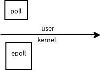

# 高级io
# 非阻塞io == 阻塞io 
# 有限状态机   
# 细节： 
# 非阻塞IO 
- 简单流程： 自然流程是结构化的
- 复杂流程： 自然流程不是结构化的
# iO多路转接:
- 作用： 监视文件描述符的行为
- select : 兼容性好，事件为单位，监控文件描述符
- poll：兼容性好，文件描述符为单位,监控事件,
- epoll： linux的poll的方言，
    - epoll_create: 创建一个epoll实例
    - epoll_ctl
    - epoll_wait

# 其他读写函数 :
- readv 
- writev 
# 储存映射io:
- mmap
- pmap： 命令查看进程的内存空间分布
# 文件锁 
